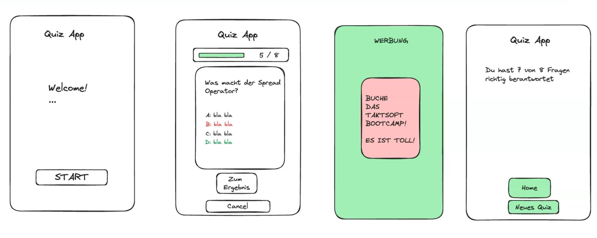

# Erstellung Quiz App -> Prozess

## Single Page Content

### Tag 1

1. Kan-Ban-Board erstellt
2. Findung der ToDo + anlegen mit Bewertung (Prio)
   - Backlog/ToDo Liste (Hirachie)
3. Color Scheme
   - Click-Dummy anhand, allgemeinen Story Board von Ralf erstellt
     
   - https://www.canva.com/colors/color-wheel/
   - Triadic color Combination
   - https://www.canva.com/templates/?query=blue+pink+green
     
     
     

### Tag 2 + 3

4. Navigation - erstes Look & Feel
   - Wie werden die einzelnen Seiten geladen
   - Pro Seite eine Componente
   - werden immer mit sprechende Name aufgerufen über useState "setScreen"
5. Fragen implementiert + Fragen Logik
   - useState active Element

### Tag 4

6. Result Page
   - (+ information Logik wieviele Fragen richtig sind)
7. Advertising Page
8. Sounds
9. History

### Tag 5 (Feinschliff + implement Feature)

10. Responsivenes
    - iPad - mini
    - Pixel 7

### Ideas Presentation

- divide your speaking time by three
- maximum of 15 min (5min each)
- shorter presentation is better than a longer presentation
- present your planning and your idea of the project
- how did your planning match with your actual experience?
- present your highlight/highlights of the code
- data structure and state
- What was really difficult?
- Are you proud of something in your code that you want to show us?
- Any learnings from your project?

## Ablauf

- Sonja -> Einleietung Präsentation Quiz App + Erklärung Oragnisation, Vorbereitung
- Peter -> Erklärung Navigation + Data Structure
- Falk -> Erklärung Fragen logik + Resultpage

## Vorstellung App Features

- Peter Erklärung Sound + Mute Button
- Falk Erklärung Data State (History) + Countdown auf Advertising Seite
